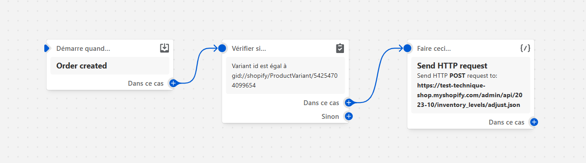
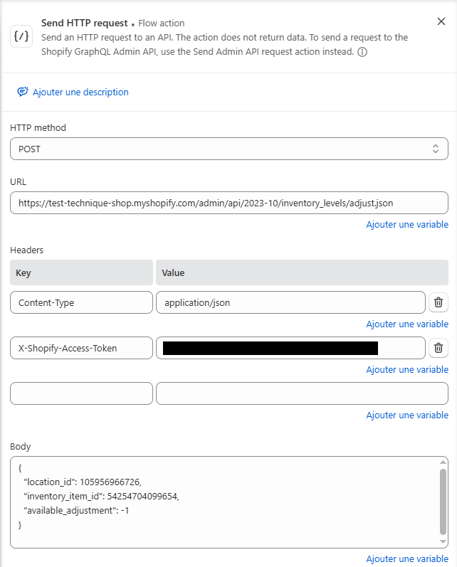
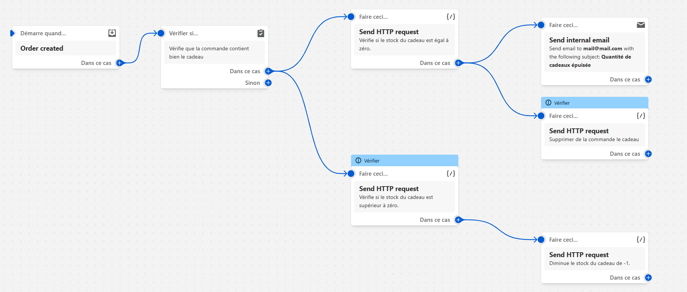

# Exercice 2 : Automatisation de la gestion de stocks via Shopify Flow
[1. Configuration du flux d'automatisation](##Configuration-du-flux-d'automatisation)
[2. Gestion des erreurs et scénarios particuliers](#gestion-des-erreurs-et-scénarios-particuliers)
[3. Documentation et démonstration technique](#documentation-et-démonstration-technique)

## Configuration du flux d'automatisation
- *Déclencheur : le flux doit se déclencher lors de la création d'une commande.*
- *Condition : vérifier que la commande contient le produit cadeau (identifié par un identifiant unique ou un SKU spécifique).*
- *Action : décompter automatiquement le stock du produit cadeau via l'API Shopify ou en envoyant une requête HTTP vers un endpoint de test. (Optionnel : prévoir une action supplémentaire, par exemple, ajuster le stock d'un produit complémentaire en cas d'achat d'un produit spécifique).*



J'ai créé un nouveau flux de travail "Gestion des stocks du produit offert", avec comme déclenchement "order created".
Puis j'ai ajouté une condition : "Vérifier si id est égal à gid://shopify/ProductVariant/54254704099654", c'est à dire vérifier si la commande contient le cadeau offert.
Dans ce cas, j'ai créé l'action "Send HTTP request" comme ceci :



Pour obtenir mon Token d'accès, voici les étapes que j'ai suivies :
1. Paramètres -> Applications et canaux de vente -> Développer des applications -> Créer une application : "Gestion Stock API"
2. Autorisation : write_inventory + read_orders 
3. Identifiants API -> générer un jeton d'accès API Admin

Pour obtenir l'ID de la boutique, il faut aller dans :
Paramètres -> Emplacement -> Choisir mon emplacement principal : l'ID ce trouve dans l'URL

## Gestion des erreurs et scénarios particuliers
- *Si le stock du produit cadeau est insuffisant (c'est-à-dire, s'il atteint zéro), documenter comment le flux pourrait gérer ce cas (alerte, annulation de l'ajout du cadeau, etc.).*
- *Expliquer dans la documentation comment le flux s'intègre avec la logique d'ajout automatique du cadeau de l'exercice 1.*


J'ai tenté d'ajouter une nouvelle condition, pour que si la commande contient le cadeau, une requête HTTP vérifie si le stock du produit est épuisé. 
La logique du flow aurait ensuite été :
- Dans ce cas : enlever le cadeau de la commande + envoyer un mail à l'admin pour l'avertir de la quantité épuisée
- Si le stock est supérieur à 0 : Send HTTP request pour diminuer le stock du cadeau de -1.

Je n'ai pas pu aller au bout de cette idée, car il n'est pas possible d'envoyer une requête HTTP avec une condition, ce qui m'aurait permis d'accéder au "Dans ce cas" -> enlever le cadeau / "Sinon" -> diminuer la quantité de -1. Et dans la requête HTTP, est n'est pas non plus possible d'écrire quelque chose du style : "available": > 0.



## Documentation et démonstration technique
- *Fournir un export JSON de la configuration du flux ou des captures d'écran illustrant la configuration dans Shopify Flow.*
- *Décrire précisément le payload envoyé lors de l'action (incluant l'ID de commande, le SKU du produit cadeau, la quantité déduite, etc.) et la logique de vérification du stock.*

Voici le payload envoyé pour diminuer la quantité du cadeau : 
```json
{
  "location_id": 105956966726,
  "inventory_item_id": 54254704099654,
  "available_adjustment": -1
}
```

Vérifier si le stock est épuisé :
```json
{
  "inventory_levels": [
    {
      "inventory_item_id": 54254704099654,
      "available": 0,
      "location_id": 105956966726
    }
  ]
}
```

**Sources :** https://shopify.dev/docs/apps/build/flow

[](../README.md)  [](./ex1-custom-cart-drawer.md)  [](./ex3-shopify-cli-versioning.md)